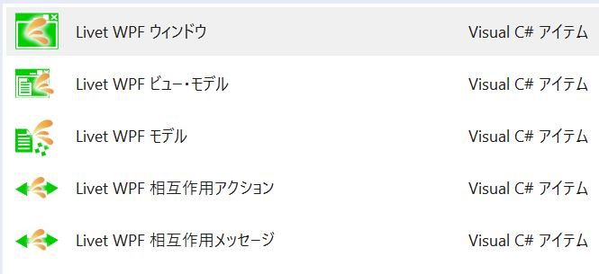

# Livet

## Livet とは

Livet(リベット) は WPF のための MVVM(Model/View/ViewModel) パターン用インフラストラクチャです。
.NET Framework 4.5.2 及び .NET Core 3.0(現在はプレビュー版です) 以上で動作し zlib/libpng ライセンスで提供しています。
zlib/libpng ライセンスでは、ライブラリとしての利用にとどめるのであれば再配布時にも著作権表示などの義務はありません。

しかし、ソースコードを改変しての再配布にはその旨の明示が義務付けられます。

## 導入

Livet は Visual Studio 2017 / 2019 の拡張機能を使用することでプロジェクトテンプレートやアイテムテンプレートやコードスニペットが追加され生産性が一番高い状態で開発が出来るように設計されています。
拡張機能は Visual Studio の拡張機能と更新プログラム でオンラインカテゴリーで Livet と検索するインストールすることが出来ます。


また、ライブラリは以下 NuGet に公開しています。

- [LivetCask](https://www.nuget.org/packages/LivetCask/)
- [LivetExtensions](https://www.nuget.org/packages/LivetExtensions/)

## Visual Studio との親和性

Livet は極力 Visual Studio の機能を活かす作りにしています。

#### Visual Studio 対応

Livet ではプロジェクトテンプレート、アイテムテンプレート、コードスニペットを提供しています。




コードスニペットは以下のものを提供しています。

- lvcom : ViewModelCommand
- lvcomn : ViewModelCommand(Non CanExecute)
- llcom : ListenerCommand(with a parameter)
- llcomn : ListenerCommand(with a parameter, Non CanExecute)
- lprop : Notification property
- lsprop : Notification property(Short version)

## View サポート

Livet では View レイヤーでデータバインディングが出来る箇所を可能な限り増やすように設計されています。

#### バインドできないプロパティをバインド可能にするビヘイビア

WPF では依存関係プロパティに対するデータバインディングがサポートされていますが、コントロールの全てのプロパティが依存関係プロパティとして定義されているわけではありません。
そのため、データバインディングで実装したくても素直に出来ないためコードビハインドに手動で View と ViewModel のデータ同期のコードが必要になるケースがあります。

Livet では、すべてのコントロールの全ての（System.Windows で始まる型のプロパティは除く）依存関係プロパティではないプロパティの端方向のバインドを可能にするビヘイビアとアクションを提供しています。

```xml
<Button Height="50" Content="マウスを乗せてください">
    <i:Interaction.Triggers>
        <i:EventTrigger EventName="MouseEnter">
            <!--  IsMouseOver は本来バインドできないプロパティ  -->
            <l:ButtonSetStateToSourceAction Source="{Binding ButtonMouseOver, Mode=TwoWay}" Property="IsMouseOver" />
        </i:EventTrigger>
        <i:EventTrigger EventName="MouseLeave">
            <!--  IsMouseOver は本来バインドできないプロパティ  -->
            <l:ButtonSetStateToSourceAction Source="{Binding ButtonMouseOver, Mode=TwoWay}" Property="IsMouseOver" />
        </i:EventTrigger>
    </i:Interaction.Triggers>
</Button>
```

```xml
<WebBrowser Grid.Row="1" Grid.ColumnSpan="2">
    <i:Interaction.Behaviors>
        <!--  Source は本来バインディング出来ないプロパティ  -->
        <l:WebBrowserSetStateToControlBehavior Source="{Binding Url}" Property="Source" />
    </i:Interaction.Behaviors>
</WebBrowser>
```

また、TextBox 用に本来バインディング出来ない SelectedText、SelectionLength、SelectionStart プロパティを双方向バインド可能にするビヘイビアを提供しています。

```xml
<TextBox>
    <i:Interaction.Behaviors>
        <l:TextBoxBindingSupportBehavior
            SelectedText="{Binding SelectedText}"
            SelectionLength="{Binding SelectionLength}"
            SelectionStart="{Binding SelectionStart}" />
    </i:Interaction.Behaviors>
</TextBox>
```

TextBox と同様に PasswordBox 用に本来バインディング出来ない Password プロパティを双方向バインド可能にするビヘイビアを提供しています。

```xml
<PasswordBox>
    <i:Interaction.Behaviors>
        <l:PasswordBoxBindingSupportBehavior Password="{Binding Password}" />
    </i:Interaction.Behaviors>
</PasswordBox>
```

#### View のイベントから ViewModel のメソッドを呼ぶアクション

Livet ではコマンドをサポートしていないイベントに対してメソッド呼び出しをする LivetCallMethodAction を提供します。
標準の CallMethodAction よりもパフォーマンスが良く、機能面でも MethodParameter プロパティを使用してメソッドに 1 つの引数を渡すことが出来ます。

```xml
<TextBox x:Name="textBox">
    <i:Interaction.Triggers>
        <i:EventTrigger EventName="TextChanged">
            <l:LivetCallMethodAction
                MethodName="TextChanged"
                MethodParameter="{Binding Text, ElementName=textBox}"
                MethodTarget="{Binding}" />
        </i:EventTrigger>
    </i:Interaction.Triggers>
</TextBox>
```

#### Messenger

Livet.Behaviors.Messaging 名前空間には Livet の Messenger などから送られたメッセージを受け取ることの出来る Action が用意されています。この Action は Messenger からメッセージを受け取るだけではなく、EventTrigger などから Action を起動することが出来るようになっています。

これにより、クリックイベントなどをきっかけにして別ウィンドウを表示したり、確認ダイアログを出したりといったことが ViewModel を経由せずに行えるためシンプルになります。

```
参考
ボタンクリックをきっかけに確認ダイアログを出して結果を元に ViewModel で処理しようとすると、一般的な MVVM をサポートするライブラリでは View でのイベントを ViewModel のコマンドで受けて、コマンドの処理の中でメッセンジャーを呼び出して View にメッセージを送って、View 側で処理を行い結果をコールバックで ViewModel に返すといった処理になります。

一般的な MVVM ライブラリの処理の流れ: View -> ViewModel -> View -> ViewModel
Livet の処理の流れ: View -> ViewModel
```

また、戻り値のあるメッセージ（確認ダイアログの表示メッセージなど）では、その戻り値を引数に渡して ViewModel のメソッドやコマンドの呼び出しにも対応しています。

ViewModel 起点の場合は、まず View に InteractionMessageTrigger を設定して Action を指定します。

```xml
<l:InteractionMessageTrigger MessageKey="MessageKey_Confirm" Messenger="{Binding Messenger}">
    <l:ConfirmationDialogInteractionMessageAction />
</l:InteractionMessageTrigger>
```

そして、ViewModel 側で Messenger を使用してメッセージを送ります。

```cs
public async void ConfirmFromViewModel()
{
    var message = new ConfirmationMessage("これはテスト用メッセージです。", "テスト", "MessageKey_Confirm")
    {
        Button = MessageBoxButton.OKCancel,
    };
    await Messenger.RaiseAsync(message);
    OutputMessage = $"{DateTime.Now}: ConfirmFromViewModel: {message.Response ?? false}";
}
```

MessageKey_Confirm というメッセージキーを元にして、どの InteractionMessageTrigger が反応するかが決まります。

View 起点の場合は Action に対して DirectInteractionMessage を指定して、DirectInteractionMessage の中に実際のメッセージを定義します。例えば、ボタンをクリックしたら確認ダイアログを出す場合は以下のようになります。

```xml
<Button Content="ConfirmFromView">
    <i:Interaction.Triggers>
        <i:EventTrigger EventName="Click">
            <l:ConfirmationDialogInteractionMessageAction>
                <l:DirectInteractionMessage CallbackMethodName="ConfirmFromView" CallbackMethodTarget="{Binding}">
                    <l:ConfirmationMessage Caption="テスト" Text="これはテスト用メッセージです。" />
                </l:DirectInteractionMessage>
            </l:ConfirmationDialogInteractionMessageAction>
        </i:EventTrigger>
    </i:Interaction.Triggers>
</Button>
```

上記の例では、Action の実行後に ViewModel の ConfirmFromView メソッドを呼ぶように指定しています。ConfirmFromView メソッドではメッセージを引数に受け取り処理を行えます。

```cs
public void ConfirmFromView(ConfirmationMessage message)
{
    OutputMessage = $"{DateTime.Now}: ConfirmFromView: {message.Response ?? false}";
}
```

Livet に標準で定義されているメッセージとアクションの組み合わせには、確認・情報ダイアログ・ファイルダイアログ・画面遷移・フォルダーダイアログ(Windows API Code Packを参照しているため Livet.Extensions という別アセンブリに定義)などがあります。

Livet.Extensions のフォルダー選択メッセージとアクションの使用例。

```xml
<Button Content="Folder">
    <i:Interaction.Triggers>
        <i:EventTrigger EventName="Click">
            <l:FolderBrowserDialogInteractionMessageAction>
                <l:DirectInteractionMessage CallbackMethodName="FolderSelected" CallbackMethodTarget="{Binding}">
                    <l:FolderSelectionMessage Description="フォルダーの選択" DialogPreference="None" />
                </l:DirectInteractionMessage>
            </l:FolderBrowserDialogInteractionMessageAction>
        </i:EventTrigger>
    </i:Interaction.Triggers>
</Button>
```

#### 汎用 EnumToBooleanConverter

Livet では System.Windows 名前空間以下の全ての Enum 型を boolean と相互変換する IValueConverter を用意しています。

```xml
<Window.WindowState>
    <Binding ElementName="checkBox" Path="IsChecked">
        <Binding.Converter>
            <l:WindowStateAndBooleanConverter
                ConvertBackDefaultBooleanValue="False"
                ConvertBackWhenNormal="True"
                ConvertWhenFalse="Maximized"
                ConvertWhenTrue="Normal" />
        </Binding.Converter>
    </Binding>
</Window.WindowState>
```

#### その他の View 機能

Blend SDK の DataTrigger は初期値に対応していません。その対処として初期値に対応する LivetDataTrigger、フォーカスを制御する SetFocusAction 、Window のクローズキャンセルや、クローズキャンセル可否判断を ViewModel に委譲する事が出来る WindowCloseCancelBehavior、RoutedEventTrigger、DataContext が IDisposable であった場合 DataContext を Dispose する DataContextDisposeAction などを用意してあります。

## ViewModel サポート

Livet は Presentation Domain Separation(PDS) に沿って開発されることを前提としています。その前提の上では ViewModel にはあまりコードが書かれないという考えの上で ViewModel サポートの機能を提供しています。

#### ViewModel の Messenger プロパティと CompositeDisposable プロパティ

Messenger は前述の View サポートの Messenger で解説したメッセージを受け取るアクションに ViewModel からメッセージを伝えるために用意されています。CompositeDisposable プロパティは IEnumerable<IDisposable> インターフェースを実装していて、ViewModel が Dispose される際に同時に破棄したいリソースを格納するために使用されます。

Livet の ViewModel 機能を使用する場合は、ViewModel と一緒に破棄したいリソースは基本的に ViewModel の CompositeDisposable プロパティに追加する事になります。

```cs
CompositeDisposable.Add(someResource);
```

#### DispatcherCollectionとReadOnlyDispatcherCollection

DispatcherCollection は、既存の変更通知コレクションをコンストラクタの引数にとり、その変更通知を指定された Dispatcher 上で行うコレクションです。ReadOnlyDispatcherCollection、DispatcherCollection をコンストラクタの引数にとる読み取り専用ラッパーとなります。

#### ViewModelHelper.CreateReadOnlyDispatcherCollection<TModel,TViewModel>

CreateReadOnlyDispatcherCollection を使用すると、Model の変更通知コレクションを指定し、その Model のコレクションの変更と連動する ReadOnlyDispatcherCollection を生成できます。Func<TModel,TViewModel> を指定して TMode l型と TViewModel 型の相互変換を行います。

```cs
var source = new ObservableCollection<int> { 1, 2, 3 };
var result = ViewModelHelper.CreateReadOnlyDispatcherCollection(
    source,
    x => new TestViewModel(x * x),
    DispatcherHelper.UIDispatcher);
```

CreateReadOnlyDispatcherCollection を使用して生成された TViewModel の要素が IDisposable であった場合、source コレクションから Remove された場合など要素削除時には Dispose が呼ばれます。
生成されたコレクションの Dispose を呼ぶことで、ソースコレクションとの連動は解除され、TViewModel が IDisposable であった場合は生成された TViewModel 型に対して Dipose が呼ばれます。

#### PropertyChangedEventListener/CollectionChangedEventListener

ViewModel では Model のイベントを監視するケースが多くあります。C# でイベントハンドラの監視と解除をラムダ式を使って行うと解除が出来ないという問題があります。

```cs
// 購読解除できない
var model = new Model();
model.PropertyChanged += (s, e) =>
{
    // do something
};
```

Livet の PropertyChangedEventListener を使用すると、ラムダ式を使用したプロパティ変更のイベントのハンドリングが出来て購読解除を行うことも出来ます。

```cs
var model = new Model();
var listener = new PropertyChangedEventListener(model)
{
    // コレクション初期化子で指定可能
    {
        // プロパティ名指定でイベントハンドラーを設定
        nameof(Model.Input1),
        (s, e) =>
        {
            // do something
        }
    },
    {
        // プロパティ名を式木で設定
        () => model.Input2,
        (s, e) =>
        {
            // do something
        }
    },
    // プロパティ名を指定せずに PropertyChanged イベントに対する処理も設定可能
    (s, e) =>
    {
        // do something
    }
};

// 個別登録も可能
listener.RegisterHandler(nameof(Model.Input1), (s, e) => { });
listener.RegisterHandler(() => model.Input2, (s, e) => { });
listener.RegisterHandler((s, e) => { });

// 購読解除（ViewModel の破棄時に解除する場合は前述の CompositeDisposable を使用
listener.Dispose();
```

CollectionChangedEventListener はそのコレクション変更通知版です。PropertyChangedEventListener ほど多機能ではありませんが似た様な事が可能です。
また、汎用 EventListener として EventListener を用意してあります。

```cs
var model = new Model();
var handler = new EventListener<EventListener<SampleEventArgs>>(
    h => model.SampleEvent += h,
    h => model.SampleEvent -= h,
    (s, e) =>
    {
        // do something
    });

// 購読解除
handler.Dispose();
```

## Model サポート

Model は MVVM の関心領域ではないため、Livet でも特に手厚いサポートはありません。
しかし最低限の機能として、変更通知イベント基底クラスとなる NotificationObject と、スレッドセーフな変更通知コレクションである ObservableSynchronizedCollection を用意してあります。
ObservableSyncronizedCollection は Monitor ベースのスレッドセーフなコレクションではなく、ReaderWriterLockSlim によるスレッドセーフなコレクションであり、読み書きが等しく複数スレッドから煩雑に行われるシナリオにおいて、パフォーマンスと変更通知のタイミングの偏りのバランスが良い様に設計されています。
前述した ViewModel の DispatcherCollection はただのラッパーであるため、Model では通常の ObservableCollection と ObservableSyncronizedCollection を用途に応じて使い分け、それを ViewModel では同様に扱う事ができます。

NotificationObject にはプロパティの定義を簡略化するための以下のメソッドが定義されています。また、NotificationObject は ViewModel クラスにも継承されているため、ここで説明する内容は ViewModel でも使用できます。

#### RaisePropertyChanged メソッド

プロパティ名指定で PropertyChanged イベントを発行します。

```cs
private string _Name;
public string Name
{
    get => _Name;
    set
    {
        _Name = value;
        RaisePropertyChanged(); // CallerMemberName により自動でプロパティ名が設定されます
    }
}
```

明示的に指定することも出来ます。

```cs
RaisePropertyChanged(nameof(Name));
```

#### RaisePropertyChangedIfSet メソッド

フィールドの更新と PropertyChanged イベントの発行を行います。このメソッドを使うとプロパティの定義は以下のようになります。このプロパティの定義は、コードスニペットの lsprop で生成できます。

```cs
private string _Name;
public string Name
{
    get => _Name;
    set => RaisePropertyChangedIfSet(ref _Name, value);
}
```

RaisePropertyChangedIfSet メソッドでは、第三引数に関連するプロパティ名を渡すことで、そのプロパティに対しても PropertyChanged イベントを発行出来ます。

```cs
private string _FirstName;
public string FirstName
{
    get => _FirstName;
    // FirstName の他に FullName の PropertyChanged イベントも発行する
    set => RaisePropertyChangedIfSet(ref _FirstName, value, nameof(FullName));
}

private string _LastName;
public string LastName
{
    get => _LastName;
    // FirstName の他に FullName の PropertyChanged イベントも発行する
    set => RaisePropertyChangedIfSet(ref _LastName, value, nameof(FullName));
}

public string FullName => $"{FirstName} {LastName}";
```

関連するプロパティが複数ある場合は配列で渡します。

```cs
public string _Hoge;
public string Hoge
{
    get => _Hoge;
    set => RaisePropertyChangedIfSet(ref _Hoge, value, new[]
    {
        nameof(Foo),
        nameof(Bar),
        nameof(Baz),
    });
}
```

## オリジナルドキュメント

本ドキュメントは下記のオリジナルドキュメントを元に加筆修正を行ったものです。

[Livet Project Home](http://ugaya40.hateblo.jp/entry/Livet)

## 今後のサポート方針

基本的に WPF がサポートされているプラットフォームに対する対応を行います。
新機能の積極的な追加などは行う予定はありません。

新機能が必要な場合は PullRequest をお願いします。機能追加の PullRequest には単体テストをつけて動作確認が出来る状態でお願いします。

Issue にはなるべく目を通すつもりですが、メール通知などを見落とすことがあります。
ノーレスポンスにするつもりはないので、もし一週間程度反応が無い場合は Twitter の @okazuki 宛にメンションください。気付くまで定期的に送ることをお勧めします。

# Authors/Mentainers

- Original author: 尾上 雅則 (Masanori Onoue) Twitter ID: ugaya40
- Mentainer: 大田　一希（Kazuki Ota） Twitter ID: okazuki

